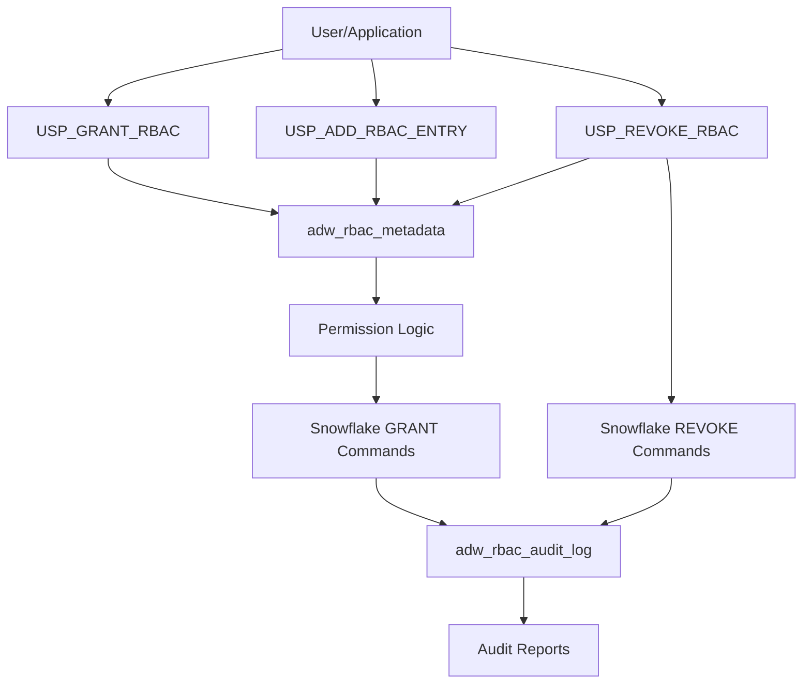

# Snowflake Role-Based Access Control (RBAC) Framework

## Comprehensive Implementation Handbook

---

## Table of Contents

1. [Overview](#overview)
2. [Architecture](#architecture)
3. [Database Objects](#database-objects)
4. [Stored Procedures](#stored-procedures)
5. [Installation Guide](#installation-guide)
6. [Usage Examples](#usage-examples)
7. [Monitoring & Maintenance](#monitoring-maintenance)
8. [Best Practices](#best-practices)
9. [Troubleshooting](#troubleshooting)
10. [Appendices](#appendices)
11. [Support and Contact](#support-and-contact)

## Overview

### Purpose

The Snowflake RBAC Framework provides an automated, auditable solution for managing table-level permissions across your Snowflake environment. It centralizes permission management through metadata-driven configuration and maintains comprehensive audit trails of all access control operations.

### Key Features

- ✅ **Metadata-Driven**: Configure permissions through simple metadata tables
- ✅ **Automated Grants**: Bulk permission assignment with filtering capabilities
- ✅ **Comprehensive Auditing**: Complete audit trail of all operations
- ✅ **Dry-Run Support**: Test permission changes before execution
- ✅ **Effective Dating**: Time-based permission management
- ✅ **Error Handling**: Robust error handling with detailed logging
- ✅ **Flexible Filtering**: Filter operations by database, schema, or role

### Benefits

- **Consistency**: Standardized approach to permission management
- **Auditability**: Complete trail of who did what and when
- **Efficiency**: Bulk operations reduce manual effort
- **Safety**: Dry-run capabilities prevent accidental changes
- **Scalability**: Handles large-scale permission management

---

## Architecture

<a id="architecture"></a>

### High-Level Design

```
┌─────────────────────────────────────────────────────────┐
│                    RBAC Framework                       │
├─────────────────────────────────────────────────────────┤
│  Metadata Layer                                         │
│  ┌─────────────────────┐  ┌─────────────────────────┐   │
│  │ adw_rbac_metadata   │  │ adw_rbac_audit_log      │   │
│  │ - Table/Role Maps   │  │ - Operation History     │   │
│  │ - Permission Types  │  │ - Success/Failure Log   │   │
│  │ - Effective Dates   │  │ - Error Details         │   │
│  └─────────────────────┘  └─────────────────────────┘   │
├─────────────────────────────────────────────────────────┤
│  Process Layer                                          │
│  ┌─────────────────────┐  ┌─────────────────────────┐   │
│  │ USP_GRANT_RBAC      │  │ USP_REVOKE_RBAC         │   │
│  │ - Grant Permissions │  │ - Revoke Permissions    │   │
│  │ - Bulk Operations   │  │ - Cleanup Operations    │   │
│  └─────────────────────┘  └─────────────────────────┘   │
│  ┌─────────────────────┐  ┌─────────────────────────┐   │
│  │ USP_ADD_RBAC_ENTRY  │  │ GET_TABLE_RBAC_STATUS   │   │
│  │ - Add Metadata      │  │ - Status Inquiry        │   │
│  └─────────────────────┘  └─────────────────────────┘   │
├─────────────────────────────────────────────────────────┤
│  Snowflake Native Objects                               │
│  ┌──────────────────────────────────────────────────┐   │
│  │         Tables, Views, Roles, Users              │   │
│  └──────────────────────────────────────────────────┘   │
└─────────────────────────────────────────────────────────┘
```

### Component Interaction Flow



---

## Database Objects

<a id="database-objects"></a>

### Schema Structure

All RBAC objects are created in the `audit` schema to maintain separation and organization.

### Table: `audit.adw_rbac_metadata`

**Purpose**: Stores the mapping between tables and roles with permission specifications.

| Column                   | Data Type                | Description                                           |
| ------------------------ | ------------------------ | ----------------------------------------------------- |
| `rbac_id`              | NUMBER(38) IDENTITY(1,1) | Primary key, auto-incrementing                        |
| `database_name`        | VARCHAR(100)             | Target database name                                  |
| `schema_name`          | VARCHAR(100)             | Target schema name                                    |
| `table_name`           | VARCHAR(100)             | Target table name                                     |
| `role_name`            | VARCHAR(100)             | Role to grant permissions to                          |
| `permission_type`      | VARCHAR(50)              | Permission type (SELECT, INSERT, UPDATE, DELETE, ALL) |
| `effective_start_date` | DATE                     | When permission becomes effective                     |
| `effective_end_date`   | DATE                     | When permission expires                               |
| `description`          | VARCHAR(500)             | Description/justification for permission              |
| `record_status_cd`     | VARCHAR(1)               | Record status ('A' = Active, 'I' = Inactive)          |
| `record_created_by`    | VARCHAR(50)              | User who created the record                           |
| `record_create_ts`     | TIMESTAMP_NTZ(9)         | Creation timestamp                                    |
| `record_updated_by`    | VARCHAR(50)              | User who last updated the record                      |
| `record_updated_ts`    | TIMESTAMP_NTZ(9)         | Last update timestamp                                 |

**Example Data**:

```sql
INSERT INTO audit.adw_rbac_metadata VALUES 
(1, 'ADW_PROD', 'ADS', 'T_MBR_DIM', 'FIN_ANALYST_ROLE', 'SELECT', '2025-01-01', NULL, 'Read access for Finance analysts', 'A', 'ADMIN_USER', '2025-01-01 10:00:00', 'ADMIN_USER', '2025-01-01 10:00:00');
```

### Table: `audit.adw_rbac_audit_log`

**Purpose**: Maintains comprehensive audit trail of all RBAC operations.

| Column                | Data Type                | Description                                      |
| --------------------- | ------------------------ | ------------------------------------------------ |
| `log_id`            | NUMBER(38) IDENTITY(1,1) | Primary key, auto-incrementing                   |
| `operation_type`    | VARCHAR(50)              | Type of operation (GRANT, REVOKE, DRY_RUN, etc.) |
| `database_name`     | VARCHAR(100)             | Database involved in operation                   |
| `schema_name`       | VARCHAR(100)             | Schema involved in operation                     |
| `table_name`        | VARCHAR(100)             | Table involved in operation                      |
| `role_name`         | VARCHAR(100)             | Role involved in operation                       |
| `permission_type`   | VARCHAR(50)              | Permission type granted/revoked                  |
| `sql_statement`     | VARCHAR(4000)            | Actual SQL statement executed                    |
| `execution_status`  | VARCHAR(20)              | Execution result (SUCCESS, FAILED)               |
| `error_message`     | VARCHAR(4000)            | Error details if operation failed                |
| `execution_time`    | TIMESTAMP_NTZ(9)         | When operation was executed                      |
| `record_status_cd`  | VARCHAR(1)               | Record status                                    |
| `record_created_by` | VARCHAR(50)              | User who executed the operation                  |
| `record_create_ts`  | TIMESTAMP_NTZ(9)         | Log entry creation time                          |
| `record_updated_by` | VARCHAR(50)              | User who updated the log                         |
| `record_updated_ts` | TIMESTAMP_NTZ(9)         | Log entry update time                            |

---

## Stored Procedures

<a id="stored-procedures"></a>

### 1. `audit.USP_GRANT_RBAC`

**Purpose**: Main procedure for granting permissions based on metadata configuration.

**Syntax**:

```sql
CALL audit.USP_GRANT_RBAC(
    p_database_filter VARCHAR(100) DEFAULT NULL,
    p_schema_filter VARCHAR(100) DEFAULT NULL,
    p_role_filter VARCHAR(100) DEFAULT NULL,
    p_dry_run_flag VARCHAR(1) DEFAULT 'N',
    p_log_details_flag VARCHAR(1) DEFAULT 'Y'
);
```

**Parameters**:

- `p_database_filter`: Filter by specific database (NULL = all databases)
- `p_schema_filter`: Filter by specific schema (NULL = all schemas)
- `p_role_filter`: Filter by specific role (NULL = all roles)
- `p_dry_run_flag`: 'Y' for dry run, 'N' for actual execution
- `p_log_details_flag`: 'Y' to enable detailed logging, 'N' to disable

**Returns**: VARCHAR(16777216) - Detailed execution report

**Key Features**:

- Processes only active records (`record_status_cd = 'A'`)
- Respects effective date ranges
- Comprehensive error handling
- Detailed audit logging
- Dry-run capability for testing

### 2. `audit.USP_ADD_RBAC_ENTRY`

**Purpose**: Adds new permission entries to the metadata table.

**Syntax**:

```sql
CALL audit.USP_ADD_RBAC_ENTRY(
    p_database_name VARCHAR(100),
    p_schema_name VARCHAR(100),
    p_table_name VARCHAR(100),
    p_role_name VARCHAR(100),
    p_permission_type VARCHAR(50) DEFAULT 'SELECT',
    p_description VARCHAR(500) DEFAULT NULL,
    p_effective_start_date DATE DEFAULT NULL,
    p_effective_end_date DATE DEFAULT NULL
);
```

**Returns**: VARCHAR(1000) - Success confirmation message

### 3. `audit.USP_REVOKE_RBAC`

**Purpose**: Revokes permissions based on metadata configuration.

**Syntax**:

```sql
CALL audit.USP_REVOKE_RBAC(
    p_database_filter VARCHAR(100) DEFAULT NULL,
    p_schema_filter VARCHAR(100) DEFAULT NULL,
    p_role_filter VARCHAR(100) DEFAULT NULL,
    p_dry_run_flag VARCHAR(1) DEFAULT 'N'
);
```

**Returns**: VARCHAR(16777216) - Detailed execution report

### 4. `audit.GET_TABLE_RBAC_STATUS`

**Purpose**: Retrieves current RBAC configuration for a specific table.

**Syntax**:

```sql
SELECT * FROM TABLE(audit.GET_TABLE_RBAC_STATUS(
    p_database_name VARCHAR(100),
    p_schema_name VARCHAR(100),
    p_table_name VARCHAR(100)
));
```

**Returns**: Table with role permissions and metadata

---

## Installation Guide

<a id="installation-guide"></a>

### Prerequisites

- Snowflake account with appropriate privileges
- SYSADMIN or ACCOUNTADMIN role for initial setup
- Database and schema creation privileges

### Step 1: Create Schema

```sql
-- Create audit schema if not exists
CREATE SCHEMA IF NOT EXISTS audit;
```

### Step 2: Execute DDL Script

```sql
-- Run the complete usp_grant_rbac.ddl script
-- This creates all tables and stored procedures
```

### Step 3: Verify Installation

```sql
-- Check tables exist
SHOW TABLES IN SCHEMA audit;

-- Check procedures exist  
SHOW PROCEDURES IN SCHEMA audit;

-- Verify table structure
DESC TABLE audit.adw_rbac_metadata;
DESC TABLE audit.adw_rbac_audit_log;
```

### Step 4: Set Permissions

```sql
-- Grant usage on schema
GRANT USAGE ON SCHEMA audit TO ROLE <your_rbac_admin_role>;

-- Grant permissions on tables
GRANT SELECT, INSERT, UPDATE ON TABLE audit.adw_rbac_metadata TO ROLE <your_rbac_admin_role>;
GRANT SELECT, INSERT ON TABLE audit.adw_rbac_audit_log TO ROLE <your_rbac_admin_role>;

-- Grant execute on procedures
GRANT USAGE ON PROCEDURE audit.USP_GRANT_RBAC() TO ROLE <your_rbac_admin_role>;
GRANT USAGE ON PROCEDURE audit.USP_ADD_RBAC_ENTRY() TO ROLE <your_rbac_admin_role>;
GRANT USAGE ON PROCEDURE audit.USP_REVOKE_RBAC() TO ROLE <your_rbac_admin_role>;
GRANT USAGE ON FUNCTION audit.GET_TABLE_RBAC_STATUS() TO ROLE <your_rbac_admin_role>;
```

---

## Usage Examples

<a id="usage-examples"></a>

### Example 1: Adding Permission Metadata

```sql
-- Add read access for Finance analysts to member dimension table
CALL audit.USP_ADD_RBAC_ENTRY(
    'ADW_PROD', 
    'ADS', 
    'T_MBR_DIM', 
    'FIN_ANALYST_ROLE', 
    'SELECT', 
    'Read access for Finance analysts to member dimension',
    CURRENT_DATE(),
    NULL
);

-- Add full access for Finance managers
CALL audit.USP_ADD_RBAC_ENTRY(
    'ADW_PROD', 
    'ADS', 
    'T_MBR_DIM', 
    'FIN_MANAGER_ROLE', 
    'ALL', 
    'Full access for Finance managers',
    CURRENT_DATE(),
    NULL
);
```

### Example 2: Dry Run Testing

```sql
-- Test what would be granted without actually executing
CALL audit.USP_GRANT_RBAC(NULL, NULL, NULL, 'Y', 'Y');
```

**Sample Output**:

```
RBAC Grant Process Started at 2025-11-05 10:30:00
========================================
🔍 DRY RUN: GRANT SELECT ON TABLE ADW_PROD.ADS.T_MBR_DIM TO ROLE FIN_ANALYST_ROLE;
🔍 DRY RUN: GRANT ALL ON TABLE ADW_PROD.ADS.T_MBR_DIM TO ROLE FIN_MANAGER_ROLE;

========================================
RBAC Grant Process Summary:
- Total Records Processed: 2
- Successful Grants: 2
- Failed Grants: 0
- Dry Run Mode: Y
Process Completed at: 2025-11-05 10:30:15
```

### Example 3: Filtered Grant Operations

```sql
-- Grant permissions only for specific database
CALL audit.USP_GRANT_RBAC('ADW_PROD', NULL, NULL, 'N', 'Y');

-- Grant permissions only for specific role
CALL audit.USP_GRANT_RBAC(NULL, NULL, 'FIN_ANALYST_ROLE', 'N', 'Y');

-- Grant permissions only for specific schema
CALL audit.USP_GRANT_RBAC('ADW_PROD', 'ADS', NULL, 'N', 'Y');
```

### Example 4: Checking Table Permissions

```sql
-- Check current permissions for a specific table
SELECT * FROM TABLE(audit.GET_TABLE_RBAC_STATUS('ADW_PROD', 'ADS', 'T_MBR_DIM'));
```

**Sample Output**:

| role_name        | permission_type | effective_start_date | effective_end_date | record_status_cd | record_create_ts    | description                      |
| ---------------- | --------------- | -------------------- | ------------------ | ---------------- | ------------------- | -------------------------------- |
| FIN_ANALYST_ROLE | SELECT          | 2025-01-01           | NULL               | A                | 2025-01-01 10:00:00 | Read access for Finance analysts |
| FIN_MANAGER_ROLE | ALL             | 2025-01-01           | NULL               | A                | 2025-01-01 10:15:00 | Full access for Finance managers |

### Example 5: Bulk Permission Management

```sql
-- Add multiple permissions at once
CALL audit.USP_ADD_RBAC_ENTRY('ADW_PROD', 'ADS', 'T_MBR_DIM', 'FIN_ANALYST_ROLE', 'SELECT', 'Read access for finance analysts');
CALL audit.USP_ADD_RBAC_ENTRY('ADW_PROD', 'ADS', 'T_MBR_DIM', 'FIN_MANAGER_ROLE', 'ALL', 'Full access for finance managers');
CALL audit.USP_ADD_RBAC_ENTRY('ADW_PROD', 'ADS', 'T_CLM_FACT', 'FIN_ANALYST_ROLE', 'SELECT', 'Read access to claims fact data');

-- Grant all finance permissions
CALL audit.USP_GRANT_RBAC('ADW_PROD', 'ADS', NULL, 'N', 'Y');
```

### Example 6: Time-Based Permissions

```sql
-- Add temporary access that expires
CALL audit.USP_ADD_RBAC_ENTRY(
    'ADW_PROD', 
    'ADS', 
    'T_MBR_DIM', 
    'TEMP_AUDITOR_ROLE', 
    'SELECT', 
    'Temporary access for quarterly audit project',
    CURRENT_DATE(),
    DATEADD(DAY, 30, CURRENT_DATE())  -- Expires in 30 days
);
```

---

## Monitoring & Maintenance

<a id="monitoring-maintenance"></a>

### 1. Audit Log Analysis

#### Check Recent Grant Operations

```sql
SELECT 
    operation_type,
    database_name,
    schema_name, 
    table_name,
    role_name,
    permission_type,
    execution_status,
    execution_time,
    error_message
FROM audit.adw_rbac_audit_log
WHERE execution_time >= DATEADD(DAY, -7, CURRENT_TIMESTAMP())
ORDER BY execution_time DESC;
```

#### Identify Failed Operations

```sql
SELECT 
        database_name || '.' || schema_name || '.' || table_name AS full_table_name,
        role_name,
        permission_type,
        error_message,
        execution_time
FROM audit.adw_rbac_audit_log
WHERE execution_status = 'FAILED'
    AND operation_type = 'GRANT'
ORDER BY execution_time DESC;
```

### 2. Permission Summary Reports

#### Permissions by Role

```sql
SELECT 
    role_name,
    COUNT(*) AS total_permissions,
    COUNT(CASE WHEN record_status_cd = 'A' THEN 1 END) AS active_permissions,
    COUNT(DISTINCT database_name) AS unique_databases,
    COUNT(DISTINCT schema_name) AS unique_schemas
FROM audit.adw_rbac_metadata
GROUP BY role_name
ORDER BY total_permissions DESC;
```

#### Permissions by Database

```sql
SELECT 
    database_name,
    schema_name,
    COUNT(*) AS total_permissions,
    COUNT(DISTINCT role_name) AS unique_roles,
    COUNT(DISTINCT table_name) AS unique_tables
FROM audit.adw_rbac_metadata
WHERE record_status_cd = 'A'
GROUP BY database_name, schema_name
ORDER BY database_name, schema_name;
```

#### Permission Types Summary

```sql
SELECT 
    permission_type,
    COUNT(*) AS total_grants,
    COUNT(DISTINCT role_name) AS unique_roles,
    COUNT(DISTINCT database_name || '.' || schema_name || '.' || table_name) AS unique_tables
FROM audit.adw_rbac_metadata
WHERE record_status_cd = 'A'
GROUP BY permission_type
ORDER BY total_grants DESC;
```

### 3. Expired Permissions Management

#### Find Expired Permissions

```sql
SELECT 
        database_name,
        schema_name,
        table_name,
        role_name,
        permission_type,
        effective_end_date,
        record_create_ts,
        description
FROM audit.adw_rbac_metadata
WHERE record_status_cd = 'A'
    AND effective_end_date IS NOT NULL
    AND effective_end_date < CURRENT_DATE()
ORDER BY effective_end_date DESC;
```

#### Disable Expired Permissions

```sql
UPDATE audit.adw_rbac_metadata
SET record_status_cd = 'I',
        record_updated_by = CURRENT_USER(),
        record_updated_ts = CURRENT_TIMESTAMP()
WHERE record_status_cd = 'A'
    AND effective_end_date IS NOT NULL
    AND effective_end_date < CURRENT_DATE();
```

### 4. Regular Maintenance Tasks

#### Daily Tasks

- Monitor failed grant operations
- Review new permission requests
- Check for expired permissions

#### Weekly Tasks

- Generate permission summary reports
- Review audit log for anomalies
- Validate active permissions against business requirements

#### Monthly Tasks

- Archive old audit log entries
- Review and update permission descriptions
- Conduct access review with business stakeholders

---

## Best Practices

<a id="best-practices"></a>

### 1. Permission Management

#### Principle of Least Privilege

- Grant only the minimum permissions required
- Use specific permission types (SELECT, INSERT, UPDATE, DELETE) rather than ALL when possible
- Regularly review and remove unnecessary permissions

#### Effective Dating

```sql
-- Use effective dates for planned access
CALL audit.USP_ADD_RBAC_ENTRY(
    'PROD_DB', 'PROJECT_SCHEMA', 'DATA_TABLE', 'PROJECT_TEAM_ROLE', 
    'SELECT', 'Project access for Q1 analysis',
    '2025-01-01',  -- Start date
    '2025-03-31'   -- End date
);
```

#### Descriptive Documentation

```sql
-- Always include meaningful descriptions
CALL audit.USP_ADD_RBAC_ENTRY(
    'PROD_DB', 'SALES_SCHEMA', 'TRANSACTIONS', 'SALES_ANALYST_ROLE', 
    'SELECT', 
    'Read access for monthly sales reporting - Approved by Sales Manager John Doe on 2025-01-15',
    CURRENT_DATE(),
    NULL
);
```

### 2. Testing and Validation

#### Always Use Dry Run First

```sql
-- Test before executing
CALL audit.USP_GRANT_RBAC('PROD_DB', 'SENSITIVE_SCHEMA', NULL, 'Y', 'Y');

-- If dry run looks good, execute for real
CALL audit.USP_GRANT_RBAC('PROD_DB', 'SENSITIVE_SCHEMA', NULL, 'N', 'Y');
```

#### Validate After Grants

```sql
-- Check that permissions were actually granted
SHOW GRANTS TO ROLE "TARGET_ROLE";

-- Verify in audit log
SELECT * FROM audit."adw_rbac_audit_log" 
WHERE "role_name" = 'TARGET_ROLE' 
  AND "execution_time" >= DATEADD(MINUTE, -10, CURRENT_TIMESTAMP());
```

### 3. Security Considerations

#### Role-Based Access Control

- Create dedicated roles for RBAC administration
- Separate read-only monitoring roles from administrative roles
- Use service accounts for automated processes

#### Audit Trail Protection

```sql
-- Restrict audit log modifications
GRANT SELECT ON audit.adw_rbac_audit_log TO ROLE RBAC_VIEWER;
-- Only admin roles should have INSERT access
```

#### Regular Security Reviews

- Monthly review of all active permissions
- Quarterly access certification process
- Annual role definition review

### 4. Performance Optimization

#### Efficient Filtering

```sql
-- Use specific filters to reduce processing time
CALL audit.USP_GRANT_RBAC('SPECIFIC_DB', 'SPECIFIC_SCHEMA', 'SPECIFIC_ROLE', 'N', 'Y');
```

#### Batch Operations

- Group related permission changes together
- Process during off-peak hours for large operations
- Monitor performance of bulk operations

### 5. Change Management

#### Documentation Standards

- Document all permission changes with business justification
- Include requestor, approver, and business purpose
- Reference ticket numbers or approval workflows

#### Approval Workflow

```sql
-- Example with approval tracking
CALL audit.USP_ADD_RBAC_ENTRY(
    'PROD_DB', 'HR_SCHEMA', 'EMPLOYEES', 'NEW_ANALYST_ROLE', 
    'SELECT', 
    'New hire access request - Ticket #HR-2025-001 - Approved by HR Director Jane Smith',
    CURRENT_DATE(),
    NULL
);
```

---

## Troubleshooting

<a id="troubleshooting"></a>

### Common Issues and Solutions

#### 1. Permission Grant Failures

**Symptom**: Grants failing with permission denied errors

```
ERROR: Access denied on table EMPLOYEES
```

**Solution**:

```sql
-- Check if executing role has GRANT privileges
SHOW GRANTS TO ROLE "CURRENT_ROLE";

-- Verify table exists and is accessible
SHOW TABLES LIKE 'EMPLOYEES' IN SCHEMA "PROD_DB"."HR_SCHEMA";

-- Check if target role exists
SHOW ROLES LIKE 'HR_ANALYST_ROLE';
```

#### 2. No Records Processed

**Symptom**: Procedure runs but processes 0 records

```
Total Records Processed: 0
```

**Troubleshooting Steps**:

```sql
-- Check metadata exists
SELECT COUNT(*) FROM audit."adw_rbac_metadata" WHERE "record_status_cd" = 'A';

-- Check effective date filtering
SELECT * FROM audit."adw_rbac_metadata" 
WHERE "record_status_cd" = 'A'
  AND ("effective_start_date" IS NULL OR "effective_start_date" <= CURRENT_DATE())
  AND ("effective_end_date" IS NULL OR "effective_end_date" >= CURRENT_DATE());

-- Check filters match data
SELECT DISTINCT "database_name", "schema_name", "role_name" 
FROM audit."adw_rbac_metadata" 
WHERE "record_status_cd" = 'A';
```

#### 3. Audit Log Not Populating

**Symptom**: Operations succeed but no audit entries created

**Solution**:

```sql
-- Check if logging is enabled
CALL audit.USP_GRANT_RBAC(NULL, NULL, NULL, 'Y', 'Y');  -- Enable logging

-- Verify audit table accessibility
SELECT COUNT(*) FROM audit."adw_rbac_audit_log";

-- Check for permission issues on audit table
SHOW GRANTS ON TABLE audit."adw_rbac_audit_log";
```

#### 4. Performance Issues

**Symptom**: Procedure takes very long to execute

**Optimization Steps**:

```sql
-- Add filters to reduce scope
CALL audit.USP_GRANT_RBAC('SPECIFIC_DB', NULL, NULL, 'N', 'Y');

-- Process in smaller batches by schema
CALL audit.USP_GRANT_RBAC('PROD_DB', 'SCHEMA1', NULL, 'N', 'Y');
CALL audit.USP_GRANT_RBAC('PROD_DB', 'SCHEMA2', NULL, 'N', 'Y');

-- Check for large result sets
SELECT "database_name", "schema_name", COUNT(*) as permission_count
FROM audit."adw_rbac_metadata" 
WHERE "record_status_cd" = 'A'
GROUP BY "database_name", "schema_name"
ORDER BY permission_count DESC;
```

### Error Code Reference

| Error Pattern             | Cause                   | Solution                          |
| ------------------------- | ----------------------- | --------------------------------- |
| `Object does not exist` | Table/role not found    | Verify object names and existence |
| `Access denied`         | Insufficient privileges | Check role permissions            |
| `SQL compilation error` | Syntax issues           | Validate SQL in dry-run mode      |
| `Timeout`               | Large operation         | Use filtering or batch processing |

### Debugging Techniques

#### Enable Detailed Logging

```sql
-- Run with full logging enabled
CALL audit.USP_GRANT_RBAC(NULL, NULL, NULL, 'Y', 'Y');

-- Check what SQL would be generated
SELECT 
    'GRANT ' || "permission_type" || 
    ' ON TABLE "' || "database_name" || '"."' || "schema_name" || '"."' || "table_name" || '"' ||
    ' TO ROLE "' || "role_name" || '"' as generated_sql
FROM audit."adw_rbac_metadata"
WHERE "record_status_cd" = 'A'
LIMIT 5;
```

#### Manual Testing

```sql
-- Test individual grants manually
GRANT SELECT ON TABLE "PROD_DB"."HR_SCHEMA"."EMPLOYEES" TO ROLE "HR_ANALYST_ROLE";

-- Verify grant worked
SHOW GRANTS TO ROLE "HR_ANALYST_ROLE";
```

---

## Appendices

<a id="appendices"></a>

### Appendix A: SQL Reference

#### Complete Permission Types

- `SELECT`: Read access to table data
- `INSERT`: Ability to add new rows
- `UPDATE`: Ability to modify existing rows
- `DELETE`: Ability to remove rows
- `TRUNCATE`: Ability to truncate table
- `REFERENCES`: Ability to create foreign key references
- `ALL`: All available permissions on the table

#### Snowflake Grant Syntax

```sql
GRANT { privilege } ON { object } TO { role }

-- Examples:
GRANT SELECT ON TABLE "DATABASE"."SCHEMA"."TABLE" TO ROLE "ROLE_NAME";
GRANT ALL ON TABLE "DATABASE"."SCHEMA"."TABLE" TO ROLE "ROLE_NAME";
GRANT INSERT, UPDATE ON TABLE "DATABASE"."SCHEMA"."TABLE" TO ROLE "ROLE_NAME";
```

### Appendix B: Metadata Schema Design

#### Design Principles

1. **Auditability**: Every change tracked with timestamp and user
2. **Flexibility**: Support for various permission types and effective dating
3. **Scalability**: Efficient indexing and partitioning strategies
4. **Maintainability**: Clear naming conventions and documentation

#### Recommended Indexes

```sql
-- Performance optimization indexes
CREATE INDEX idx_rbac_metadata_status ON audit."adw_rbac_metadata" ("record_status_cd");
CREATE INDEX idx_rbac_metadata_dates ON audit."adw_rbac_metadata" ("effective_start_date", "effective_end_date");
CREATE INDEX idx_rbac_metadata_role ON audit."adw_rbac_metadata" ("role_name");
CREATE INDEX idx_rbac_audit_time ON audit."adw_rbac_audit_log" ("execution_time");
```

### Appendix C: Integration Patterns

#### CI/CD Integration

```yaml
# Example GitLab CI/CD pipeline step
deploy_rbac_permissions:
  stage: deploy
  script:
    - snowsql -f rbac_permissions.sql
    - snowsql -q "CALL audit.USP_GRANT_RBAC('PROD_DB', NULL, NULL, 'N', 'Y')"
  only:
    - main
```

#### API Integration

```python
# Example Python integration
import snowflake.connector

def grant_rbac_permissions(database_filter=None, schema_filter=None, role_filter=None, dry_run=True):
    conn = snowflake.connector.connect(
        user='your_user',
        password='your_password',
        account='your_account'
    )
  
    cursor = conn.cursor()
  
    sql = f"""
    CALL audit.USP_GRANT_RBAC(
        '{database_filter}', 
        '{schema_filter}', 
        '{role_filter}', 
        '{'Y' if dry_run else 'N'}', 
        'Y'
    )
    """
  
    cursor.execute(sql)
    result = cursor.fetchone()[0]
  
    cursor.close()
    conn.close()
  
    return result
```

### Appendix D: Migration Guide

#### From Manual Grant Management

1. **Audit Current State**: Document all existing grants
2. **Create Metadata**: Populate RBAC metadata tables
3. **Validate**: Use dry-run to verify configuration
4. **Cutover**: Execute actual grants and disable manual processes

#### From Other RBAC Systems

1. **Export Configuration**: Extract existing permission mappings
2. **Transform Data**: Convert to RBAC metadata format
3. **Import**: Load into adw_rbac_metadata table
4. **Reconcile**: Compare and validate permissions

---

## Support and Contact

<a id="support-and-contact"></a>

### Documentation Version

- **Version**: 1.0
- **Last Updated**: November 5, 2025
- **Authors**: Data Engineering Team

### Change Log

| Version | Date       | Changes         |
| ------- | ---------- | --------------- |
| 1.0     | 2025-11-05 | Initial release |

### Support Resources

- **Snowflake Documentation**: [Link to internal wiki]

---

*This handbook provides comprehensive guidance for implementing and managing the Snowflake RBAC Framework. For additional support or questions, please contact the Data Engineering team.*
